# 트랜잭션 (Transaction)과 잠금 (Lock)

## 1. 트랜잭션 (Transaction)

### 1-1. 트랜잭션 소개

#### 1) 트랜잭션이란?

* `트랜잭션`은 하나의 논리적인 작업 단위에 포함된 쿼리가 모두 수행 되거나 전혀 수행되지 않도록 해주는 기능이다.

    * 즉, 데이터의 정합성을 보장하기 위한 기능이다.

* 예시를 통해 트랜잭션에 대해서 배워보자.

    * A가 B에게 10 만원을 이체한다면 각자의 계좌는 어떻게 변경 될까?

        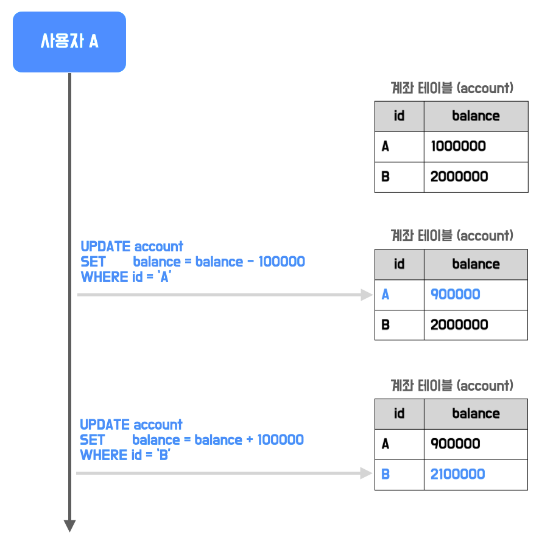
    
        * ① 먼저 A의 계좌에서 10 만원을 뺀다. (90 만원이 남게 된다.)

        * ② 그 다음, B의 계좌 잔액에 10 만원을 더한다. (210 만원이 된다.)

    * 만약 A가 B에게 10 만원을 이체하는 과정에서 A 계좌에서 10 만원을 빼는 쿼리는 실패하고 B의 계좌 잔액에 10만원을 더하는 쿼리만 성공 했다고 가정해보자.

        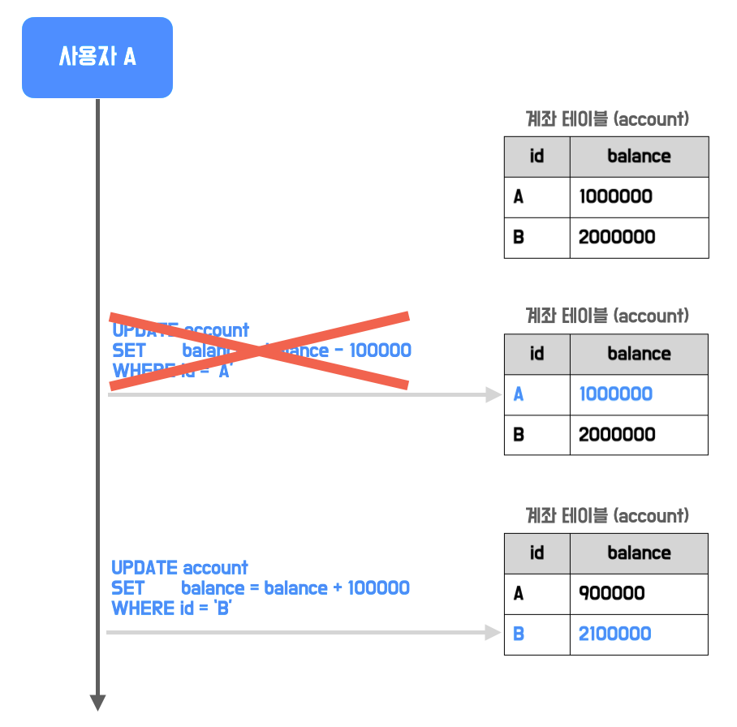

        * A 계좌 잔액은 그대로 있고 B 계좌에는 존재하지 않던 10 만원이 생기게 된다.

        * 계좌 이체라는 작업은 정상적으로 동작하지 않은 것이다.

    * 즉, 계좌 이체라는 작업에 포함된 모든 쿼리를 하나의 단위로써 처리 되도록 하는 것이 바로 트랜잭션이다.

        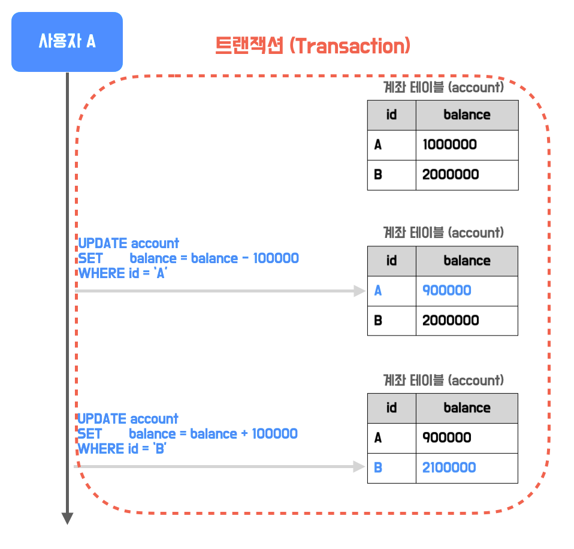

#### 2) MySQL에서 트랜잭션 사용하기

* **(1) 예시**

    * 이전에 살펴 본 계좌 이체 예제를 MySQL의 Transaction를 사용해서 구현해 보겠다.

      

        * ① 트랜잭션을 시작한다.

        * ② A의 계좌에서 10 만원을 뺀다.

        * ③ B의 계좌에 10 만원을 넣는다.

        * ④ 커밋을 한다.

        * ⑤ SELECT 문으로 account 테이블의 내용을 조회한다.

    * 여기서 A가 B에게 20 만원을 추가로 이체 해보자.

      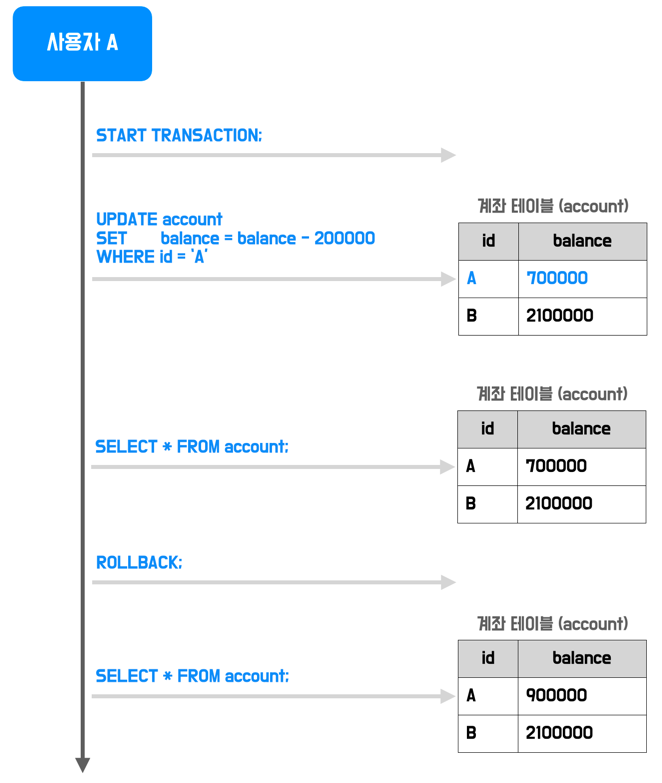

        * ① 트랜잭션을 시작한다.

        * ② A의 계좌에서 20 만원을 뺀다.

        * ③ SELECT 문으로 account 테이블의 내용을 조회한다.

            * 원래 A 계좌에 90 만원이 있었는데, 앞에서 20 만원을 뺏기 때문에 70 만원이 있는 상황이다.

            * 하지만 B 계좌에는 UPDATE를 해주지 않았기 때문에 잔액이 210 만원인 상황이다.

        * ④ 계좌 이체를 취소하고 싶어서 롤백을 한다.

        * ⑤ SELECT 문으로 account 테이블의 내용을 조회한다.

            * 계좌 이체를 하기 전 금액으로 돌아간 것을 확인할 수 있다.

* **(2) 트랜잭션 관련 MySQL 명령**

    * `START TRANSACTION` : 트랜잭션을 시작한다.

        * MySQL에서는 START TRANSACTION이 실행되면 AUTOCOMMIT은 비활성화 된다.

        * 그리고 COMMIT, ROLLBACK과 함께 트랜잭션이 종료되면 원래 AUTOCOMMIT 상태로 돌아간다.

    * `COMMIT` : 트랜잭션의 변경사항을 DB에 반영한다. (그 다음, 트랜잭션을 종료한다.)

    * `ROLLBACK` : 트랜잭션의 변경사항을 취소한다. (그 다음, 트랜잭션을 종료한다.)

* **(3) AUTOCOMMIT**

    * `AUTOCOMMIT` : 각 SQL 문 실행 마다 자동으로 COMMIT 해주는 기능이다.

        * MySQL은 기본 값으로 AUTOCOMMIT이 활성화 되어 있다.

        * 현재 AUTOCOMMIT 설정 상태를 확인하는 방법은 아래와 같다.

            ```sql
            SELECT  @@AUTOCOMMIT;
            ```

        * AUTOCOMMIT을 설정하는 방법은 아래와 같다. (1: 활성화, 0: 활성화 되어 있지 않음)

            ```sql
            SET AUTOCOMMIT = 1;   // 각 SQL 문 실행 마다 즉시 영구 반영됨 (기본 값)
            
            SET AUTOCOMMIT = 0;   // 각 SQL 문 실행 시에 즉시 반영되지 않고 COMMIT 또는 ROLLBACK 명령 실행 시에 영구 반영된다.
            ```

#### 3) Java에서 트랜잭션 사용하기

* **(1) 일반적인 Transaction 사용 패턴**

    * ① 트랜잭션을 시작한다.

    * ② 데이터를 읽거나 쓰는 등의 SQL 문들을 포함해서 로직을 수행한다.

    * ③-① 트랜잭션에 포함된 SQL 문들이 문제 없이 동작 했다면 트랜잭션을 커밋 (Commit) 한다.

    * ③-② 만약 중간에 문제가 발생 했다면 트랜잭션을 롤백 (Rollback) 한다.

* **(2) Java 트랜잭션 예제**

    ```java
    try {
        Connection connection = dataSource.getConnection(); // DB 커넥션을 얻는다.
        connection.setAutoCommit(false);                    // AutoCommit을 false로 변경한다. (이는 SQL의 START TRANSACTION과 같은 의미다.)
    
        // 일련의 작업을 수행한다.
        ...
        connection.commit();                // 작업을 성공적으로 완료 했다면 커밋을 한다.
    } catch (Exception e) {
        ...
        connection.rollback();              // 에러가 발생하면 트랜잭션을 롤백한다.
    } finally {
        connection.setAutoCommit(true);     // AutoCommit을 true로 변경한다.
    }
    ```

#### 4) ACID

* 트랜잭션은 다음 4가지 특성으로 정의되며 그 앞글자를 따서 ACID 특성이라고 한다.

    * `Atomicity (원자성)` : 트랜잭션 내 모든 SQL 문은 수행 되거나 전혀 수행되지 않아야 한다.

        * 즉, 완료되지 않은 트랜잭션의 중간 상태를 DB에 반영해서는 안 된다.

    * `Consistency (일관성)` : 트랜잭션이 완료되면 데이터는 일관된 상태로 남아 있어야 한다.

        * `일관된 상태 (Correct State)` : 제약 조건(도메인의 유효 범위, 무결성 제약조건 등)을 위배하지 않는 정상적인 상태를 말한다.

        * 예를 들어, A 계좌에 70 만원이 있고 B 계좌에는 200 만원이 있는 상태에서 A가 B에게 100 만원을 이체하려고 한다면 어떻게 될까?

          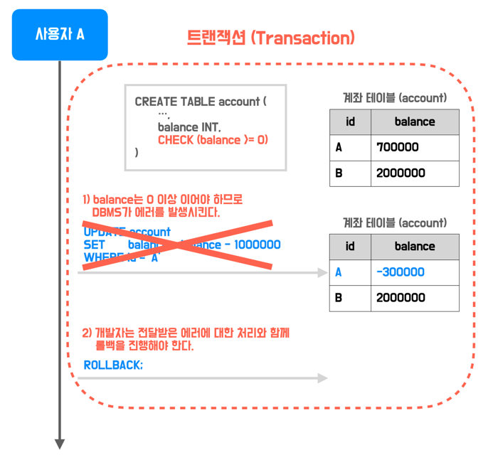

            * A 계좌에서 100 만원을 빼면 잔액은 -30 만원이 된다.

            * 그런데 문제가 하나 있다.

                * account 테이블은 balance가 0 이상이어야 한다는 제약 조건이 설정되어 있었다.

            * 따라서 A 계좌에서 100만원을 빼는 UPDATE문은 실패하며 에러가 발생하게 될 것이다.

            * 이러한 경우에는 개발자가 해당 에러에 대한 처리와 함께 롤백 처리를 해야 한다.

    * `Isolation (격리성)` : 각 트랜잭션은 서로 간섭 없이 독립적으로 수행 되어야 한다.

        * 즉, 여러 트랜잭션들이 동시에 실행 되더라도 각 처리가 모순 없이 실행되는 것을 보장한다는 것이다. (이 말은 여러 트랜잭션들이 순서대로 실행되는 경우와 같은 결과를 얻을 수 있는 상태를 말함)

            * [참고] 각 트랜잭션이 실행되는 시간이 겹친다면 동시에 실행되는 것으로 볼 수 있다.

        * 예를 들어, 호텔에 남은 싱글룸 수가 10개인데, 2명의 사용자가 동시에 예약하는 경우를 생각 해보자.

            * 빈 싱글룸 수가 올바르지 않은 시나리오

              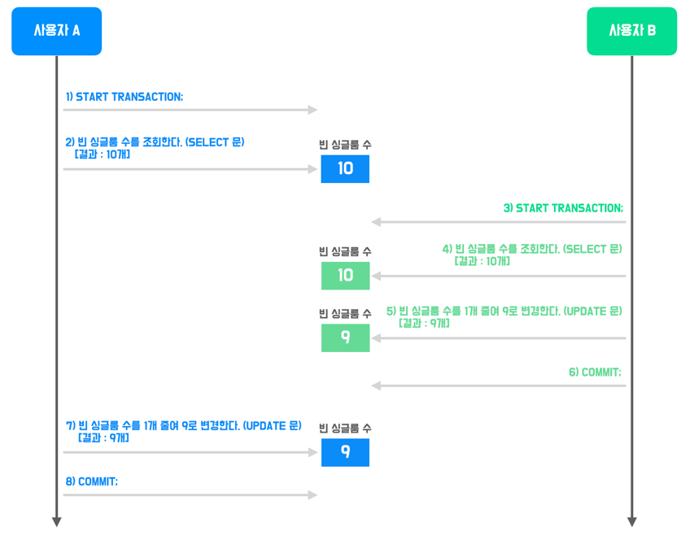

                * 2명이 방을 확보한다면 원래 빈 싱글룸 수는 2개가 줄어야 하지만, 같은 방을 동시에 확보하게 되면 빈 싱글룸 수는 1개만 줄어들게 된다.

                * 이러한 상황이 발생하는 것을 막기 위해 데이터베이스에는 잠금 (Lock)을 걸어서 후속 처리를 차단 (Block) 하는 방법이 있다.

            * 빈 싱글룸 수가 바르게 처리되는 시나리오

              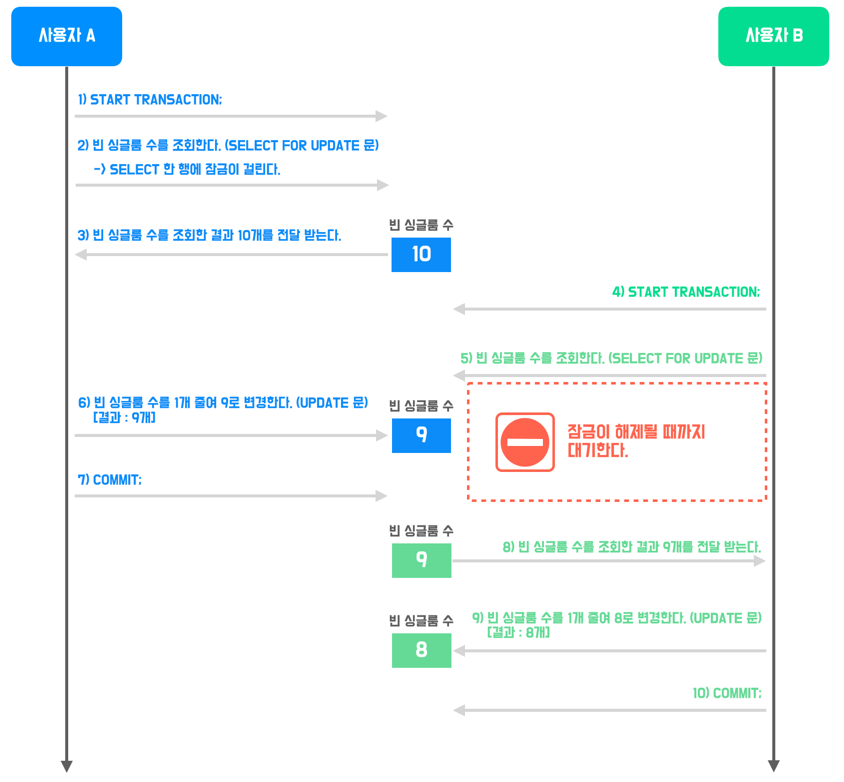

        * 격리성을 완전히 보장하기 위해 모든 트랜잭션을 순차적으로 실행한다면 동시 처리 성능이 매우 나빠지게 된다.

            * 그래서 ANSI 표준은 트랜잭션의 격리 수준을 4단계로 나누어 정의하고 있다. (트랜잭션의 격리성과 동시 처리 성능 사이의 Trade-off를 두고)

    * `Durability (지속성)` : 트랜잭션이 완료되면 변경사항은 영구적으로 유지되어야 한다.

        * 즉, DBMS에 문제가 발생하더라도 데이터베이스 로그 등을 사용해서 성공한 트랜잭션의 내용을 복구할 수 있어야 한다.

### 1-2. 잠금

#### 1) 잠금

* `잠금 (Lock)` : 공유 리소스의 동시성을 제어하기 위한 기능이다.

    * 여러 커넥션에서 동일한 자원을 동시에 변경 하려고 하는데, 잠금이 없다면 하나의 데이터를 여러 커넥션에서 동시에 변경할 수 있게 된다.

    * 결과적으로 해당 데이터는 예측할 수 없는 상태가 된다.

    * 잠금은 여러 커넥션에서 동시에 동일한 자원(레코드나 테이블)을 변경할 경우 어느 한 시점에는 하나의 커넥션만 변경할 수 있게 해주는 역할을 한다.

* 데이터베이스 잠금은 크게 두 가지로 나뉜다.

    * `공유 잠금 (Shared Lock)` : 다른 트랜잭션이 같은 데이터를 읽는 것을 허용한다.

        * 공유 잠금은 공유 잠금끼리 동시에 접근이 가능하지만, 공유 잠금이 설정된 데이터에 배타 잠금은 사용할 수 없다.

        * 다른 말로 읽기 잠금 (Read Lock)이라고도 한다.

    * `배타 잠금 (Exclusive Lock)` : 다른 트랜잭션이 같은 데이터를 읽거나 쓰는 것(INSERT, UPDATE, DELETE)을 허용하지 않는다.

        * 배타 잠금은 잠금이 해제될 때까지 다른 트랜잭션(공유 잠금, 배타 잠금 포함)은 해당 데이터에 접근할 수 없다.

        * 다른 말로 쓰기 잠금 (Write Lock)이라고도 한다.

#### 2) Two Phase Locking Protocol

* **(1) Lock을 사용하더라도 트랜잭션의 직렬성을 보장하지 않는 경우**

    * Lock을 사용하더라도 항상 트랜잭션의 직렬성을 보장하지는 않는다.

        * `직렬성 (Serialization)` : 여러 트랜잭션이 동시에 수행 되더라도 각 트랜잭션이 하나씩 차례대로 수행되는 것과 같은 결과를 보장하는 특성을 말한다.

    * 트랜잭션의 직렬성을 보장하는 예시를 한번 살펴보자.

      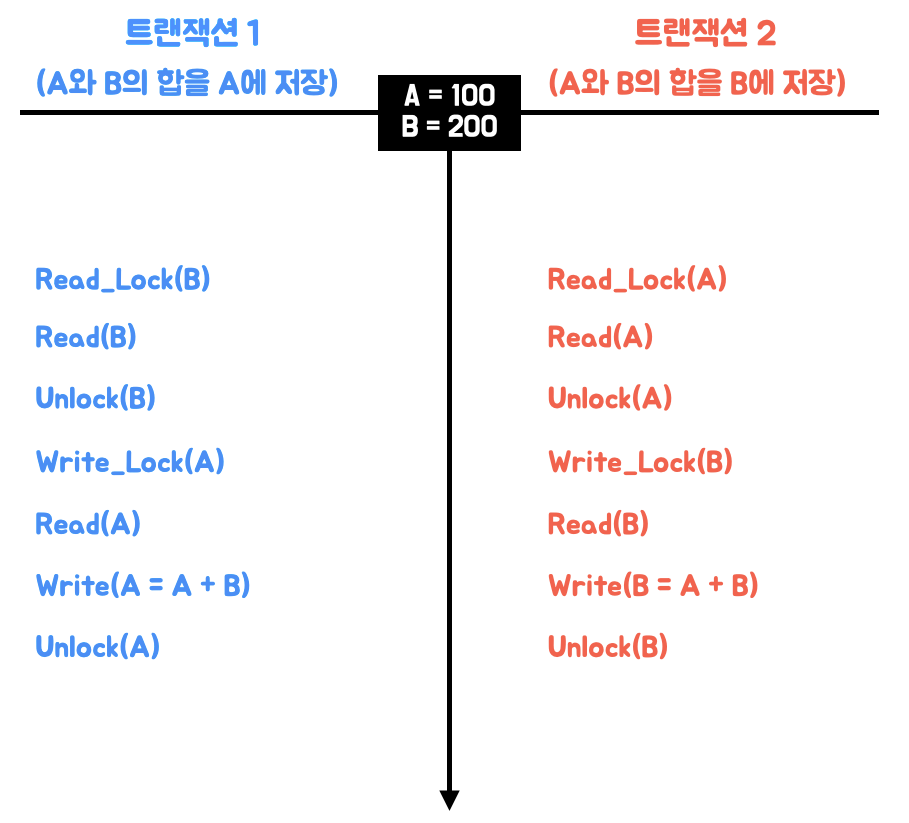

        * 위 그림의 상황을 설명하자면 아래와 같다.

            * 현재 데이터베이스에 100이 저장된 A와 200이 저장된 B라는 데이터가 있다.

            * 그리고 2개의 트랜잭션이 있는데, 트랜잭션 1번은 A와 B의 합을 A에 저장하는 트랜잭션이며 트랜잭션 2번은 A와 B의 합을 B에 저장하는 트랜잭션이다.

            * [참고] `Read_Lock`는 읽기 잠금, `Write_Lock`는 쓰기 잠금, `Unlock`는 잠금 해제를 의미한다.

        * 이러한 상황에서 각 트랜잭션이 순차적으로 수행된다면 그 결과는 어떻게 될까?

            * 트랜잭션 1번이 먼저 수행된 다음, 트랜잭션 2번이 수행되면 그 결과는 `A = 300, B = 500`이 된다.

            * 반대로 트랜잭션 2번이 먼저 수행된 다음, 트랜잭션 1번이 수행되면 그 결과는 `A = 400, B = 300`이 된다.

    * 이제 Lock을 사용하더라도 트랜잭션의 직렬성을 보장하지 않는 경우에 대해서 살펴보자.

      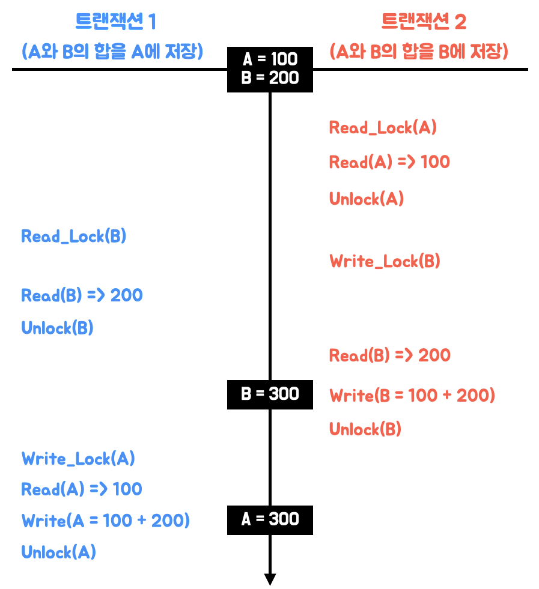

        * ① 트랜잭션 2번이 먼저 시작하면서 A에 대한 읽기 잠금을 획득한다.

        * ② 이어서 A를 읽는다. 이때 A의 값은 100이다.

        * ③ 그리고 A에 대한 읽기 잠금을 해제한다.

        * ④ 이 타이밍에 트랜잭션 1번이 시작되고 B에 대한 읽기 잠금을 획득한다.

        * ⑤ 이어서 트랜잭션 2번이 B에 대한 쓰기 잠금을 획득하려고 시도한다.

            * 하지만 트랜잭션 1번이 B에 대한 읽기 잠금을 획득한 상태이기 때문에 트랜잭션 2번은 대기하게 된다.

        * ⑥ 그 다음, 트랜잭션 1번이 B를 읽는다. 이때 B의 값은 200이다.

        * ⑦ 그리고 B에 대한 잠금을 해제한다.

        * ⑧ B에 대한 쓰기 잠금이 해제되기를 기다리고 있던 트랜잭션 2번은 B에 대한 쓰기 잠금을 획득하게 된다.

        * ⑨ 그리고 B를 읽는다. 이때 B의 값은 200이다.

        * ⑩ A와 B의 값을 더한 결과인 300을 B에 저장한다.

            * 이어서 B에 대한 잠금을 해제한다.

        * ⑪ 이제 트랜잭션 1번은 A에 대한 쓰기 잠금을 획득한다.

        * ⑫ 그리고 A의 값을 읽는다. 이때 A의 값은 100이다.

        * ⑬ A와 B의 값을 더한 결과인 300을 A에 저장한다.

        * ⑭ 그 다음, A에 대한 잠금을 해제한다.

    * 결과를 보면 우리가 먼저 예상했던 결과와는 다르다.

        * 즉, 트랜잭션의 직렬성을 보장하지 않고 있다.

* **(2) 트랜잭션의 직렬성을 보장 하도록 Lock을 사용하는 경우**

    * 앞서 살펴본 문제를 해결하려면 다음과 같이 수행 되어야 한다.

      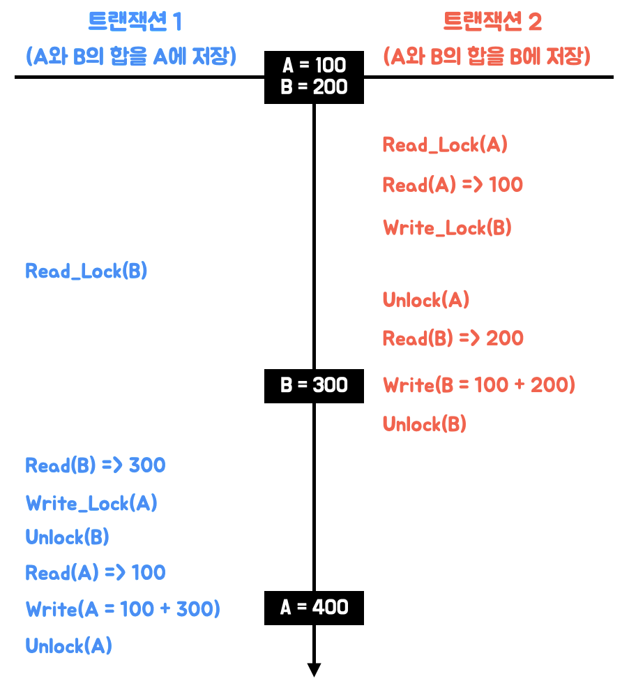

    * Lock과 관련된 연산만 살펴 보면 문제의 해결책을 알 수 있다.

      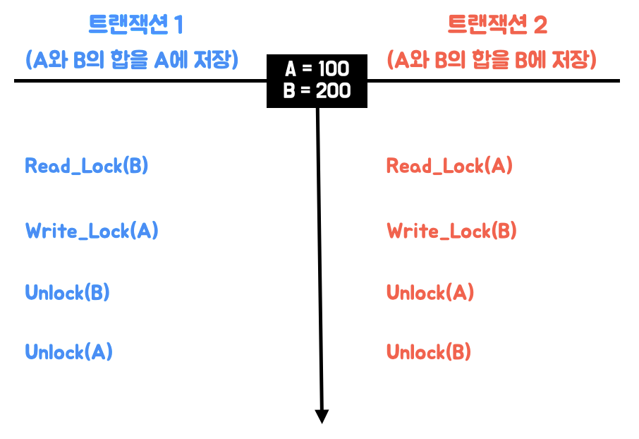

        * 각 트랜잭션에서 모든 잠금(Lock) 연산이 최초의 잠금 해제(Unlock) 연산 보다 먼저 수행 되도록 하는 것이다. 이것을 2PL Protocol이라 한다.

        * 즉, 한번 unlock 되기 시작하면 그 이후에는 새로운 Lock을 획득하지 않는다.

* **(3) 2 단계 잠금 규약**

    * `2 단계 잠금 규약 (2PL Protocol, Two Phase Locking Protocol)` : 모든 경우에 직렬 실행을 보장하는 잠금 규칙을 말한다.

        * 트랜잭션은 이 규칙을 따를 때, 잠금을 얻는 단계와 잠금을 해제하는 단계로 나누어 수행한다.

          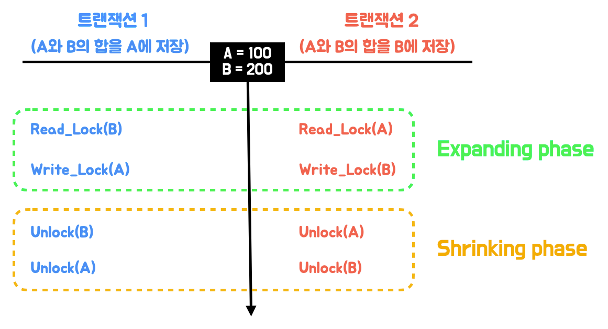

            * `Expanding phase` : 트랜잭션이 잠금을 얻는 단계를 말한다.

            * `Shrinking phase` : 트랜잭션이 잠금을 해제하는 단계를 말한다.

        * 2 단계 잠금을 사용하다 보면 상황에 따라서 데드락(Deadlock)이 발생할 수 있다.

#### 3) 비관적 잠금과 낙관적 잠금

* `비관적 잠금 (Pessimistic Lock)` : 데이터베이스의 잠금 기능을 사용하여 동시성을 제어하는 방법이다.

    * "현재 변경 하고자 하는 레코드는 다른 트랜잭션에서도 변경할 수 있다"라는 비관적인 가정을 하기 때문에 먼저 변경 하고자 하는 레코드에 대해 잠금을 획득하고 변경 작업을 처리한다.

    * 데이터베이스가 제공하는 잠금 (Lock) 기능을 사용한다.

        * 대표적으로 `SELECT FOR UPDATE` 구문이 있다.

* `낙관적 잠금 (Optimistic Lock)` : 각 트랜잭션이 같은 레코드를 변경할 가능성은 상당히 적을 것이라고 (낙관적으로) 가정하는 잠금 방식이다.

    * 데이터베이스가 제공하는 잠금(Lock) 기능을 사용하지 않고 엔티티의 버전을 통해서 동시성을 제어한다.

        * 즉, 애플리케이션 레벨에서 지원하는 잠금이다.

    * 트랜잭션을 커밋하기 전까지는 트랜잭션의 충돌을 알 수 없다.

#### 4) MySQL에서 사용되는 잠금

* MySQL에서 사용되는 잠금은 크게 MySQL 엔진 레벨과 스토리지 엔진 레벨로 나눌 수 있다.

    * MySQL 엔진의 잠금

        * MySQL 엔진에는 잠금 글로벌 락, 테이블 락, 네임드 락, 메타데이터 락을 제공한다.

    * 스토리지 엔진의 잠금

        * 여러 스토리지 엔진 중에서 InnoDB 스토리지 엔진은 레코드 락, 갭 락, 넥스트 키 락, 자동 증가 락을 제공한다.

        * InnoDB 잠금의 종류는 다음 그림을 보면 좀 더 이해하기 쉽다.

          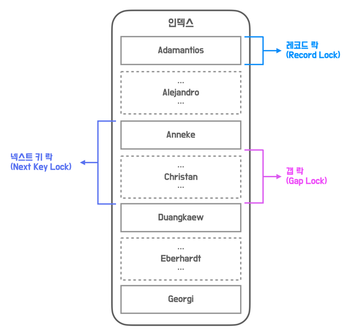

            * `레코드 락 (Record lock)` : 레코드 자체만을 잠그는 것을 말한다.

                * 다른 상용 DBMS의 레코드 락과 동일한 역할을 한다.

                * 한 가지 중요한 차이는 InnoDB 스토리지 엔진은 레코드 자체가 아니라 인덱스의 레코드를 잠근다는 점이다.

            * `갭 락 (Gap lock)` : 레코드와 바로 인접한 레코드 사이의 간격만을 잠그는 것을 말한다.

                * 갭 락의 역할은 레코드와 레코드 사이의 간격에 새로운 레코드가 생성(INSERT) 되는 것을 제어하는 것이다.

                * 갭 락은 그 자체보다는 이어서 설명할 넥스트 키 락의 일부로 자주 사용된다.

            * `넥스트 키 락 (Next key lock)` : 레코드 락과 갭 락을 합쳐 놓은 형태의 잠금을 말한다.

#### 5) 인덱스와 잠금

* InnoDB의 잠금은 레코드를 잠그는 것이 아니라 인덱스를 잠그는 방식으로 처리된다.

    * 즉, 변경해야 할 레코드를 찾기 위해 검색한 인덱스의 레코드에 대해 모두 락을 건다.

* 정확한 이해를 위해 다음 UPDATE 문장을 한 번 살펴보자.

    ```sql
    /* employees 테이블에는 아래와 같이 first_name 컬럼만 멤버로 담긴 ix_firstname 이라는 인덱스가 준비되어 있다.
       KEY ix_firstname (first_name)
       employess 테이블에서 first_name = 'Georgi'인 사원은 전체 253명이 있으며,
       first_name = 'Georgi' 이고 last_name = 'Klassen'인 사원은 딱 1명만 있는 것을 아래 쿼리로 확인할 수 있다. */
    
    mysql> SELECT COUNT(*) FROM employees WHERE first_name = 'Georgi'; 
    +----------+
    |       253|
    +----------+
    
    mysql> SELECT COUNT(*) FROM employees WHERE first_name = 'Georgi' AND last_name = 'Klassen'; 
    +----------+
    |         1|
    +----------+
    
    /* employees 테이블에서 first_name = 'Georgi' 이고 last_name = 'Klassen'인 사원의 
       입사 일자를 오늘로 변경하는 쿼리를 실행해보자. */
    mysql> UPDATE employees SET hire_date = NOW() WHERE first_name = 'Georgi' AND last_name = 'Klassen'; 
    ```

    * UPDATE 문장이 실행되면 1건의 레코드가 업데이트될 것이다.

    * 하지만 이 1건의 업데이트를 위해 몇 개의 레코드에 락을 걸어야 할까?

    * 이 UPDATE 문장의 조건에서 인덱스를 이용할 수 있는 조건은 `first_name = 'Georgi'` 이며 last_name 컬럼은 인덱스에 없기 때문에 `first_name = 'Georgi'` 인 레코드 253 건의 레코드가 모두 잠긴다.

* 아래 그림은 예제의 UPDATE 문장이 어떻게 변경 대상 레코드를 검색하고, 실제 변경이 수행되는지를 보여준다.

  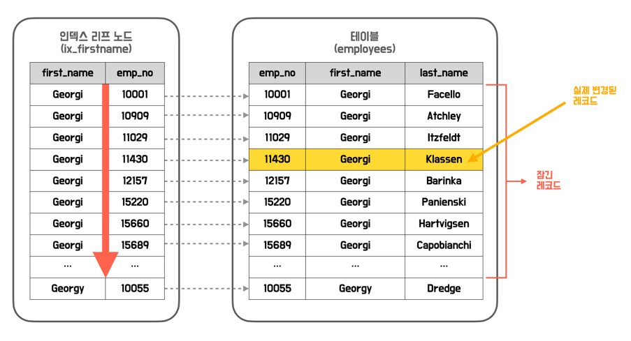

#### 6) InnoDB의 기본 잠금 방식 [RealMySQL 구버전 자료]

* InnoDB에서는 각 쿼리의 패턴 별로 사용하는 잠금이 다르다.

    * SELECT

        * InnoDB 테이블에 대해서는 레코드를 SELECT 할 때 레코드에 아무런 잠금도 걸지 않는데, 이를 잠금 없는 읽기 (Non Locking Consistent Read)라고 한다.

        * 하지만 SELECT 쿼리를 이용해 읽은 레코드의 컬럼 값을 애플리케이션에서 가공해서 다시 업데이트 하고자 할 때는 SELECT가 실행된 후 다른 트랜잭션이 그 컬럼의 값을 변경하지 못하게 해야 한다.

        * 이럴 때는 레코드를 읽으면서 강제로 잠금을 걸어 둘 필요가 있는데, 이때 사용하는 옵션이 LOCK IN SHARE MODE와 FOR UPDATE다.

            ```sql
            SELECT * FROM employess WHERE emp_no=10001 LOCK IN SHARE MODE; -- 읽기 잠금
            SELECT * FROM employees WHERE emp_no=10001 FOR UPDATE; -- 쓰기 잠금
            ```

            * `LOCK IN SHARE MODE` : SELECT 된 레코드에 대해서 읽기 잠금을 설정한다. (MySQL 8.0 버전 부터는 `FOR SHARE`로 변경됨)

                * 다른 트랜잭션에서는 읽기 잠금이 걸린 레코드를 읽을 수는 있지만 변경하지는 못한다.

            * `FOR UPDATE` : SELECT 된 레코드에 대해서 쓰기 잠금을 설정한다.

                * 다른 트랜잭션에서는 쓰기 잠금이 걸린 레코드를 변경하는 것뿐만 아니라 읽기 잠금도 수행할 수 없다.

    * INSERT, UPDATE, DELETE

        * INSERT, UPDATE, DELETE 쿼리는 모두 기본적으로 쓰기 잠금을 사용한다. (필요 시에는 읽기 잠금을 사용할 수도 있다.)

        * InnoDB에서는 UPDATE와 DELETE를 실행할 때 SQL 문의 조건에 일치하는 레코드를 찾기 위해 참조하는 인덱스의 모든 레코드에 잠금을 건다.

            * 이는 해당 쿼리의 WHERE 조건에 일치하지 않는 레코드라도 잠금의 대상이 될 수 있음을 의미한다.

            * 예를 들어, 아래 쿼리에서 first_name에만 인덱스가 존재한다면 first_name이 Georgi인 모든 레코드가 잠기게 된다.

              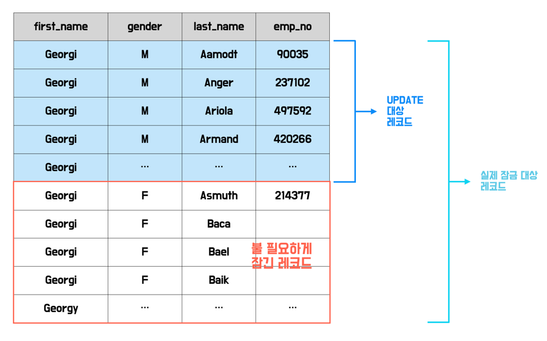

                ```sql
                UPDATE  employees
                SET     last_name = '...'
                WHERE   first_name = 'Gerogi' 
                AND     gender = 'F'
                ```

        * 그러므로 테이블 크기와 상관 없이 UPDATE, DELETE 실행 시에도 인덱스 생성을 고려해야 한다.

            * 해당 UPDATE, DELETE 쿼리가 이용할 인덱스가 없다면 InnoDB 스토리지 엔진은 모든 레코드를 대상으로 잠금을 걸 것이기 때문이다.

### 1-3. MVCC

#### 1) 잠금 기반의 동시성 제어와 MVCC의 차이점

* **(1) 잠금 기반의 동시성 제어 (Lock Based Concurrency Control)**

    * 서로 다른 트랜잭션이 같은 데이터에 둘 다 읽기 잠금을 거는 경우를 제외하고 나머지 모든 경우에 대해서는 한 쪽이 블록(block) 되기 때문에 전체 처리량이 좋지 않다.

      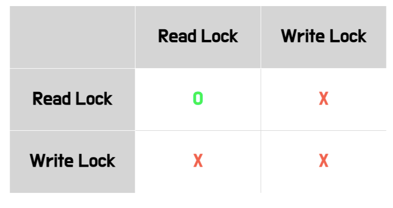

* **(2) MVCC**

    * 위와 같은 상황에서 좀 더 처리량을 높이기 위해서 읽기 잠금과 쓰기 잠금을 거는 경우만이라도 해결 해보자는 생각에 등장하게 된 것이 바로 MVCC다.

      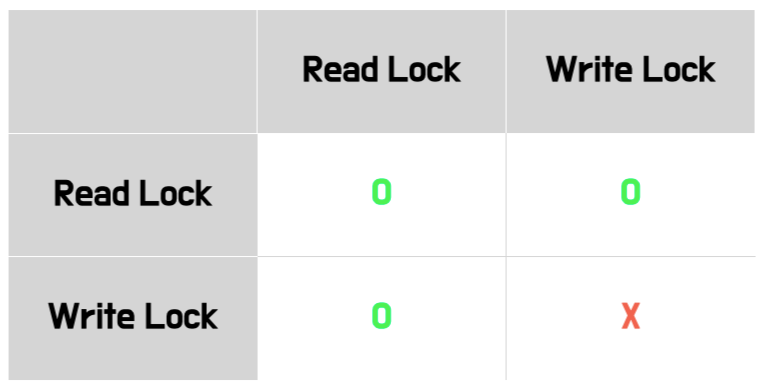

        * 서로 다른 트랜잭션이 같은 데이터에 둘 다 쓰기 잠금을 거는 경우에는 한 쪽이 블록 되지만 나머지 모든 경우에 대해서는 블록이 되지 않고 동시에 처리할 수 있다.
        
#### 2) MVCC란 무엇일까?

* `MVCC (Multi Version Concurrency Control)` : (하나의 레코드에 대해 여러 개의 버전을 동시에 관리해서) 잠금을 사용하지 않는 일관된 읽기를 제공함으로써 동시성을 높여주는 방법이다.

    * MVCC의 가장 큰 목적은 잠금을 사용하지 않는 일관된 읽기를 제공하는 데 있다.

        * InnoDB는 언두 로그 (Undo log)를 이용해 이 기능을 구현한다.

    * 여기서 멀티 버전 (Multi Version)은 하나의 레코드에 대해 여러 개의 버전이 동시에 관리된다는 의미다.

    * MVCC의 동작을 이해하기 위해 트랜잭션 격리 수준이 READ_COMMITTED인 MySQL 서버에서 InnoDB 스토리지 엔진을 사용하는 테이블의 변경을 어떻게 처리하는지 그림으로 한 번 살펴보자.

        * 우선 다음과 같은 테이블에 한 건의 레코드를 INSERT 한 다음 UPDATE 해서 발생하는 변경 작업 및 절차를 확인해 보자.

            ```sql
            CREATE TABLE member (
                m_id     INT NOT NULL,
                m_name   VARCHAR(20) NOT NULL,
                m_area   VARCHAR(100) NOT NULL,
                PRIMARY KEY (m_id),
                INDEX ix_area (m_area)   
            );
            
            INSERT INTO member (m_id, m_name, m_area) VALUES (12, '홍길동', '서울');
            
            COMMIT;
            ```

        * INSERT 문이 실행되면 데이터베이스의 상태는 아래 그림과 같은 상태로 변경될 것이다.

          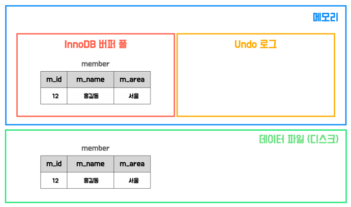

        * 아래 그림은 MEMBER 테이블에 UPDATE 문장이 실행될 때의 처리 절차를 그림으로 보여준다.

            ```sql
            UPDATE member SET m_area = '경기' WHERE m_id = 12;
            ```

          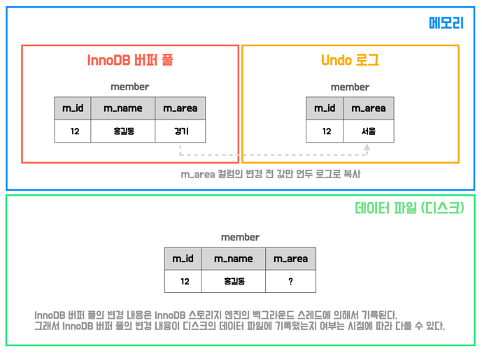

            * UPDATE 문장이 실행되면 기존 데이터는 언두 영역으로 복사하고 InnoDB의 버퍼 풀은 (커밋 실행 여부와 관계 없이) 새로운 값('경기')으로 업데이트된다.

            * 그리고 디스크의 데이터 파일에는 체크포인트나 InnoDB의 Write 스레드에 의해 새로운 값으로 업데이트돼 있을 수도 있고 아닐 수도 있다.

                * InnoDB가 ACID를 보장하기 때문에 일반적으로는 InnoDB의 버퍼 풀과 데이터 파일은 동일한 상태라고 가정해도 무방하다.

        * 아직 COMMIT이나 ROLLBACK이 되지 않은 상태에서 다른 사용자가 다음과 같은 쿼리로 작업 중인 레코드를 조회하면 어디에 있는 데이터를 조회할까?

            ```sql
            SELECT * FROM member WHERE m_id = 12;
            ```

        * 이 질문의 답은 MySQL 서버에 설정된 트랜잭션 격리 수준에 따라 다르다는 것이다.

            * 격리 수준이 READ_UNCOMMIITED인 경우에는 InnoDB 버퍼 풀이 현재 가지고 있는 변경된 데이터를 읽어서 반환한다.

                * 즉, 데이터가 커밋됐든 아니든 변경된 상태의 데이터를 반환한다.

            * READ_COMMITTED 나 그 이상의 격리 수준 (REPEATABLE_READ, SERIALIZABLE)인 경우에는 아직 커밋되지 않았기 때문에 변경되기 이전의 내용을 보관하고 있는 언두 영역의 데이터를 반환한다.

        * 이러한 과정을 DBMS에서는 MVCC라고 표현한다.

            * 즉, 하나의 레코드(회원 번호가 12인 레코드)에 대해 2개의 버전이 유지되고, 필요에 따라 어느 데이터가 보여지는지 여러 가지 상황에 따라 달라지는 구조다.

#### 3) 잠금 없는 일관된 읽기 (Non-Locking Consistent Read)

* InnoDB 스토리지 엔진은 MVCC 기술을 이용해 잠금을 걸지 않고 읽기 작업을 수행한다.

* 잠금을 걸지 않기 때문에 InnoDB에서 읽기 작업은 다른 트랜잭션이 가지고 있는 잠금을 기다리지 않고, 읽기 작업이 가능하다.

* 다음 그림처럼 특정 사용자가 레코드를 변경하고 아직 커밋을 수행하지 않았다 하더라도 이 변경 트랜잭션이 다른 사용자의 SELECT 작업을 방해하지 않는다.

  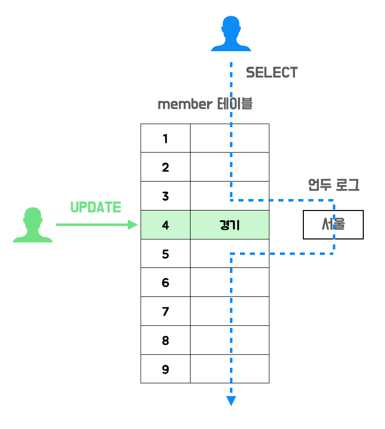

#### 4) MVCC 설명과 관련된 용어

* `체크 포인트 (CheckPoint)` : (데이터 파일에 기록되지 않은) 버퍼 풀 내의 변경된 페이지를 디스크의 데이터 파일에 기록하는 것을 말한다.

* `InnoDB 버퍼 풀` : 디스크의 데이터 파일이나 인덱스 정보를 메모리에 캐시해 두는 공간이다.

    * 쓰기 작업을 지연시켜 일괄 작업으로 처리할 수 있게 해주는 버퍼 역할도 한다.

    * 일반적인 애플리케이션에서는 INSERT, UPDATE, DELETE 처럼 데이터를 변경하는 쿼리는 데이터 파일의 이곳저곳에 위치한 레코드를 변경하기 때문에 랜덤한 디스크 작업을 발생시킨다.

    * 하지만 버퍼 풀이 이러한 변경된 데이터를 모아서 처리하면 랜덤한 디스크 작업의 횟수를 줄일 수 있다.

* 리두 로그와 언두 로그

    * `재실행 로그 (Redo Log)` : 데이터 변경 사항을 디스크에 기록하기 전에 백업한 데이터를 말한다.

        * MySQL 서버가 비정상적으로 종료 되더라도 작업을 이어서 하기 위한 로그다.

        * MySQL 서버가 비정상 종료되는 경우, InnoDB 스토리지 엔진의 데이터 파일은 다음과 같은 두 가지 종류의 일관되지 않은 데이터를 가질 수 있다.

            * [첫 번째 경우] 커밋됐지만 데이터 파일에 기록되지 않은 데이터

                * 리두 로그를 사용하여 데이터를 복구한다.

            * [두 번째 경우] 롤백됐지만 데이터 파일에 이미 기록된 데이터

                * 리두 로그와 언두 로그를 모두 사용하여 데이터를 복구한다.

                * 여기서 리두 로그는 최소한 그 변경이 커밋됐는지, 롤백됐는지, 아니면 트랜잭션의 실행 중간 상태였는지를 확인하기 위해서 필요하다.

    * `실행 취소 로그 (Undo Log)` : DML (INSERT, UPDATE, DELETE)로 변경되기 전의 데이터를 별도로 백업한 데이터를 말한다.

        * 언두 로그는 크게 두 가지 용도로 사용된다.

            * [첫 번째 용도] 트랜잭션의 롤백을 대비

                * 트랜잭션이 롤백되면 트랜잭션 도중 변경된 데이터를 변경 전 데이터로 복구할 때 언두 로그를 사용한다.

            * [두 번째 용도] 트랜잭션의 격리 수준을 유지하면서 높은 동시성을 제공

                * 특정 커넥션에서 데이터를 변경하는 도중에 다른 커넥션에서 데이터를 조회하면 트랜잭션 격리 수준에 맞게 변경 중인 레코드를 읽지 않고 언두 로그에 백업해 둔 데이터를 읽어서 반환한다.

### 1-4. 트랜잭션 격리 수준

#### 1) 트랜잭션 격리 수준

* `트랜잭션 격리 수준 (Transaction Isolation Level)` : 특정 트랜잭션이 다른 트랜잭션에서 조회하거나 변경하는 데이터를 볼 수 있도록 허용할지 말지를 결정하는 것이다.

    * 격리 수준은 크게 4 가지 (READ UNCOMMITTED, READ COMMITTED, REPEATABLE READ, SERIALIZABLE)로 나뉜다.

    * 4개의 격리 수준에서 순서대로 뒤로 갈수록 각 트랜잭션 간의 데이터 격리(고립) 정도가 높아지며, 동시 처리 성능도 떨어지는 것이 일반적이다.

        * 격리 수준이 높아질수록 MySQL 서버의 처리 성능이 많이 떨어질 것으로 생각하는 사용자가 많은데, 사실 SERIALIZABLE 격리 수준이 아니라면 크게 성능 개선이나 저하는 발생하지 않는다.

    * 데이터베이스의 격리 수준을 이야기 하면 항상 함께 언급되는 세 가지 부정합의 문제점이 있다.

        * 이 세 가지 부정합의 문제는 격리 수준의 레벨에 따라 발생할 수도 있고 발생하지 않을 수도 있다.

            * ① `Dirty Read` : 어떤 트랜잭션이 처리한 작업이 커밋되지 않았는데도 다른 트랜잭션에서 볼 수 있는 현상을 말한다.

            * ② `Non Repeatable Read` : 하나의 트랜잭션 내에서 같은 쿼리를 두 번 실행 했을 때, 그 사이에 다른 트랜잭션이 값을 변경함으로써 두 쿼리의 결과가 다르게 나타나는 현상을 말한다.

            * ③ `Phantom Read` : 하나의 트랜잭션 내에서 같은 쿼리를 두 번 실행 했을 때, 그 사이에 다른 트랜잭션이 삽입/삭제를 함으로써 첫 번째 쿼리에서 없던 레코드(유령, Phantom)가 두 번째 쿼리에서 나타나는 현상을 말한다.

                * 또는 첫 번째 쿼리에서 있던 레코드가 두 번째 쿼리에서 없어지는 현상

#### 2) 각 트랜잭션 격리 수준을 상세하게 알아보기

* **(1) READ UNCOMMITTED**

    * `READ UNCOMMITTED` : 커밋되지 않은 트랜잭션의 변경 사항을 다른 트랜잭션이 읽는 것을 허용하는 격리 수준이다.

        * 아래 그림은 다른 트랜잭션이 사용자 B가 실행하는 SELECT 쿼리의 결과에 따라 어떤 영향을 미치는지를 보여주는 예제다.

          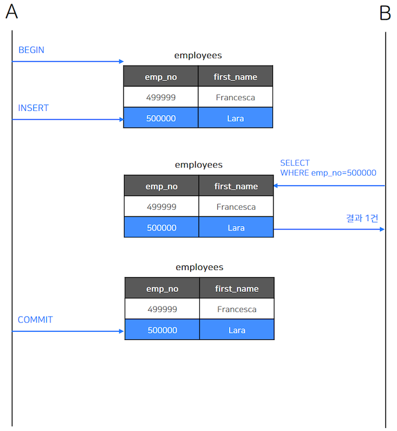

            * ① 사용자 A는 emp_no가 500000이고 first_name이 "Lara"인 새로운 사원을 INSERT 한다.

            * ② 사용자 A가 변경된 내용을 커밋하기도 전에 사용자 B는 emp_no=500000인 사원을 검색하고 있다.

            * ③ 하지만 사용자 B는 사용자 A가 INSERT한 사원 정보를 커밋되지 않은 상태에서도 조회할 수 있다.

            * ④ 그런데 문제는 만약 사용자 A가 처리 도중 알 수 없는 문제가 발생해 INSERT된 내용을 롤백한다고 하더라도 여전히 사용자 B는 Lara가 정상적인 사원이라고 생각하고 계속해서 처리할 것이라는 점이다.

                * 이처럼 어떤 트랜잭션에서 처리한 작업이 완료되지 않았는데도 다른 트랜잭션에서 볼 수 있는 현상을 더티 리드(Dirty Read)라 한다.

                * 더티 리드를 유발하는 READ UNCOMMITTED는 RDBMS 표준에서는 트랜잭션의 격리 수준으로 인정하지 않을 정도로 정합성에 문제가 많은 격리 수준이다.

                * MySQL을 사용한다면 최소한 READ COMMITTED 이상의 격리 수준을 사용할 것을 권장한다.

* **(2) READ COMMITTED**

    * `READ COMMITTED` : 커밋이 완료된 트랜잭션의 변경사항만 다른 트랜잭션이 읽는 것을 허용하는 격리 수준이다.

        * 아래 그림은 READ COMMITTED 격리 수준에서 사용자 A가 변경한 내용이 사용자 B에게 어떻게 조회되는지 보여준다.

          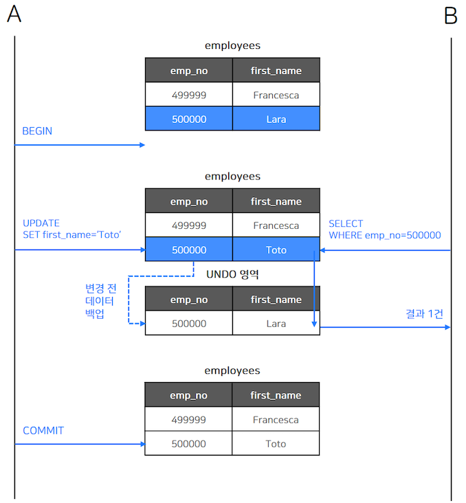

            * ① 사용자 A는 emp_no=500000인 사원의 first_name을 "Lara"에서 "Toto"로 변경했는데, 이때 새로운 값인 "Toto"는 employees 테이블에 즉시 기록되고 이전 값인 "Lara"는 언두 영역으로 백업된다.

            * ② 사용자 A가 커밋을 수행하기 전에 사용자 B가 emp_no=500000인 사원을 SELECT 하면 조회된 결과의 first_name 컬럼의 값은 "Toto"가 아닌 "Lara"로 조회된다.

                * 여기서 사용자 B의 SELECT 쿼리 결과는 employees 테이블이 아니라 언두 영역에 백업된 레코드에서 가져온 것이다.

                * READ COMMITED 격리 수준에서는 어떤 트랜잭션에서 변경한 내용이 커밋되기 전까지는 다른 트랜잭션에서 그러한 변경 내역을 조회할 수 없기 때문이다.

            * ③ 최종적으로 사용자 A가 변경된 내용을 커밋하면 그때부터는 다른 트랜잭션에서도 백업된 언두 레코드("Lara")가 아니라 새롭게 변경된 "Toto"라는 값을 참조할 수 있게 된다.

        * READ COMMITTED 격리 수준에서는 `Non Repeatable Read`(REPEATABLE READ가 불가능하다)라는 부정합 문제가 발생할 수 있다.

        * 아래 그림은 `Non Repeatable Read`가 왜 발생하고 어떤 문제를 만들어낼 수 있는지 보여준다.

          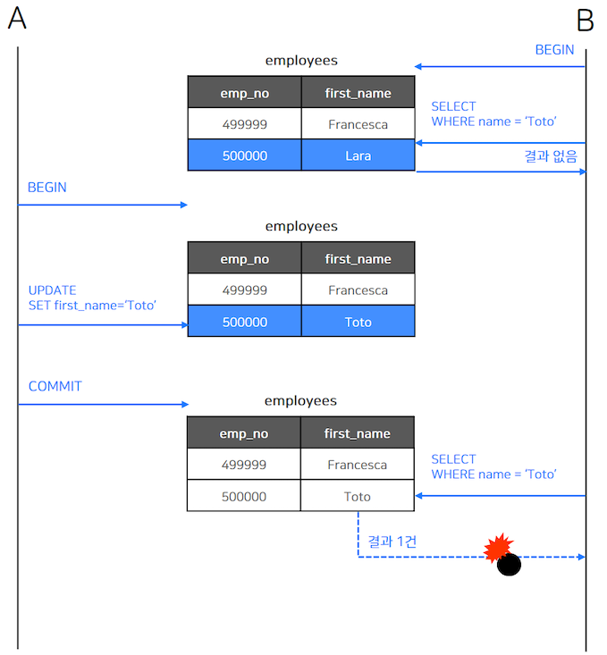

            * ① 처음 사용자 B가 BEGIN 명령으로 트랜잭션을 시작하고 first_name이 "Toto"인 사용자를 검색 했는데, 일치하는 결과가 없었다.

            * ② 하지만 사용자 A가 사원번호가 500000인 사원의 이름을 "Toto"로 변경하고 커밋을 실행한 이후, 사용자 B가 똑같은 SELECT 쿼리로 다시 조회하면 이번에는 결과가 1건이 조회된다.

                * 이는 별다른 문제가 없어보이지만 하나의 트랜잭션 내에서 똑같은 SELECT 쿼리를 실행 했을 때는 항상 같은 결과를 가져와야 한다는 REPEATABLE READ 정합성에 어긋나는 것이다.

                * 이러한 부정합 현상은 하나의 트랜잭션에서 동일 데이터를 여러 번 읽고 변경하는 작업이 금전적인 처리와 연결되면 문제가 될 수도 있다.

                * 예를 들어, 어떤 트랜잭션에서 입금과 출금 처리가 계속 진행될 때 다른 트랜잭션에서 오늘 입금된 금액의 총합을 조회한다고 가정해보자.

                * 그런데 REPEATABLE READ가 보장되지 않기 때문에 총합을 계산하는 SELECT 쿼리는 실행될 때 마다 다른 결과를 가져올 것이다.

                * 중요한 것은 사용 중인 트랜잭션의 격리 수준에 의해 실행하는 SQL 문장이 어떤 결과를 가져오게 되는지를 정확히 예측할 수 있어야 한다는 것이다.

        * [참고]

            * 가끔 사용자 중에서 트랜잭션 내에서 실행되는 SELECT 문장과 트랜잭션 없이 실행되는 SELECT 문장의 차이를 혼동하는 경우가 있다.

            * READ COMMITTED 격리 수준에서는 트랜잭션 내에서 실행되는 SELECT 문장과 트랜잭션 외부에서 실행되는 SELECT 문장의 차이가 별로 없다.

            * 하지만 REPETABLE READ 격리 수준에서는 기본적으로 SELECT 쿼리 문장도 트랜잭션 범위 내에서만 작동한다.

            * 즉, START TRANSACTION (또는 BEGIN) 명령으로 트랜잭션을 시작한 상태에서 온종일 동일한 쿼리를 반복해서 실행해봐도 동일한 결과만 보게 된다. (아무리 다른 트랜잭션에서 그 데이터를 변경하고 COMMIT을 실행한다고 하더라도 말이다)

* **(3) REPEATABLE READ**

    * `REPEATABLE READ` : 같은 트랜잭션 내에서 조회한 데이터는 항상 동일함을 보장하는 격리 수준이다.

        * REPEATABLE READ는 MySQL의 InnoDB 스토리지 엔진에서 기본으로 사용되는 격리 수준이다.

        * InnoDB 스토리지 엔진은 트랜잭션이 ROLLBACK 될 가능성에 대비해 변경되기 전 레코드를 언두(Undo) 영역에 백업 해두고 실제 레코드 값을 변경한다.

            * 이러한 변경 방식을 MVCC (Multi Version Concurrency Control)라고 한다.

        * REPETABLE READ는 MVCC를 위해 언두 영역에 백업된 이전 데이터를 이용해 동일 트랜잭션 내에서는 동일한 결과를 보여줄 수 있게 보장한다.

        * 아래 그림은 REPEATABLE READ 격리 수준이 작동하는 방식을 보여준다.

            * 우선 이 시나리오가 실행되기 전에 employees 테이블은 번호가 6인 트랜잭션에 의해 데이터가 INSERT 됐다고 가정하자.

            * 그래서 아래 그림에서 employees 테이블의 초기 두 레코드는 트랜잭션 번호가 6인 것으로 표현된 것이다.

            * 아래 시나리오에서는 사용자 A가 emp_no가 500000인 사원의 이름을 변경하는 과정에서 사용자 B가 emp_no=500000인 사원을 SELECT 할 때 어떤 과정을 거쳐서 처리되는지 보여준다.

              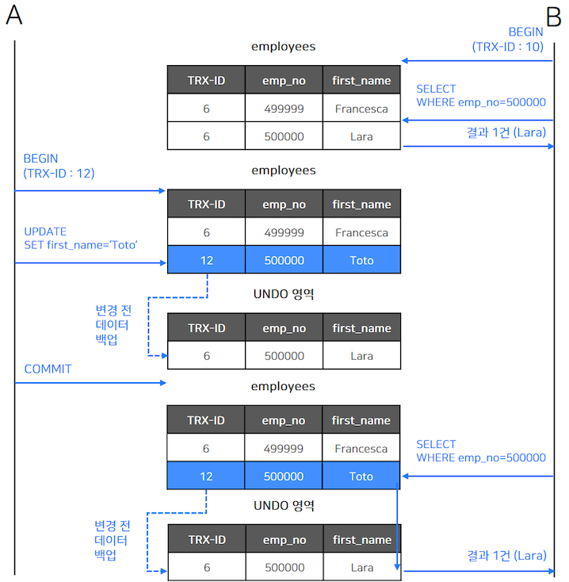

                * ① 사용자 A의 트랜잭션 번호는 12이며 사용자 B의 트랜잭션의 번호는 10 이었다.

                * ② 이때 사용자 A는 사원의 이름을 "Toto"로 변경하고 커밋을 수행했다.

                * ③ 그런데 A 트랜잭션이 변경을 수행하고 커밋을 했지만, 사용자 B가  emp_no=500000인 사원인 사원을 A 트랜잭션의 변경 전후 각각 한 번씩 SELECT 했는데 결과는 항상 "Lara"라는 값을 가져온다.

                    * 사용자 B가 BEGIN 명령으로 트랜잭션을 시작하면서 10번이라는 트랜잭션 번호를 부여 받았는데, 그때부터 사용자 B의 10번 트랜잭션 안에서 실행되는 모든 SELECT 쿼리는 트랜잭션 번호가 10(자신의 트랜잭션 번호) 보다 작은 트랜잭션 번호에서 변경한 것만 보게 된다.

                    * 위의 그림에서는 언두 영역에 백업된 데이터가 하나만 있는 것으로 표현됐지만 사실 하나의 레코드에 대해 백업이 하나 이상 얼마든지 존재할 수 있다.

                    * 한 사용자가 BEGIN으로 트랜잭션을 시작하고 장시간 트랜잭션을 종료하지 않으면 언두 영역이 백업된 데이터로 무한정 커질 수도 있다. 이렇게 언두에 백업된 레코드가 많아지면 MySQL 서버의 처리 성능이 떨어질 수 있다.

        * REPEATABLE READ 격리 수준에서는 Phantom Read라는 부정합 문제가 발생할 수 있다.

            * 아래 그림에서는 사용자 A가 employees 테이블에 INSERT를 실행하는 도중에 사용자 B가 `SELECT .. FOR UPDATE` 쿼리로 employees 테이블을 조회했을 때 어떤 결과를 가져오는지 보여준다.

              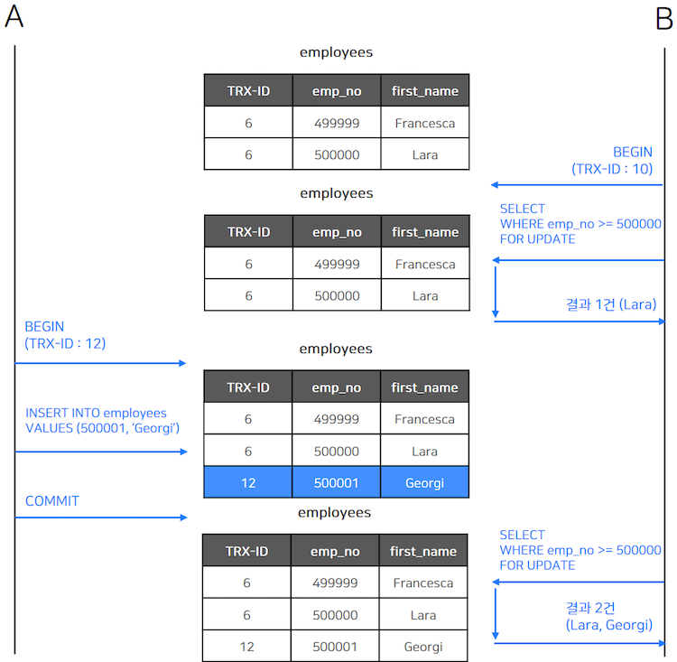

                * ① 사용자 B는 BEGIN 명령으로 트랜잭션을 시작한 후, SELECT를 수행한다.

                    * 그러므로 이전 REPEATABLE READ 예시 그림에서 배운 것처럼 두 번의 SELECT 쿼리 결과는 똑같아야 한다.

                * ② 하지만 위의 그림에서 사용자 B가 실행하는 두 번의 SELECT FOR UPDATE 쿼리 결과는 서로 다르다.

                    * 이렇게 다른 트랜잭션에서 수행한 변경 작업에 의해 레코드가 보였다가 안 보였다가 하는 현상을 PHANTOM READ라고 한다.

                    * `SELECT .. FOR UPDATE` 쿼리는 SELECT하는 레코드에 쓰기 잠금을 걸어야 하는데, 언두 레코드에는 잠금을 걸 수 없다.

                    * 그래서 `SELECT .. FOR UPDATE` 또는 `SELECT .. LOCK IN SHARE MODE`로 조회되는 레코드는 언두 영역의 변경 전 데이터가 아닌 현재 레코드의 값을 가져오게 된다.

            * 다행히도 InnoDB 스토리지 엔진에서는 갭 락과 넥스트 키 락 덕분에 REPEATABLE READ 격리 수준에서도 Phantom Read가 발생하지 않는다.

* **(4) SERIALIZABLE**

    * `SERIALIZABLE` : 한 트랜잭션에서 사용하는 데이터를 다른 트랜잭션에서는 접근할 수 없다.

        * `Phantom Read`가 발생하지 않으나 동시 처리 성능이 급격히 떨어지게 된다.

